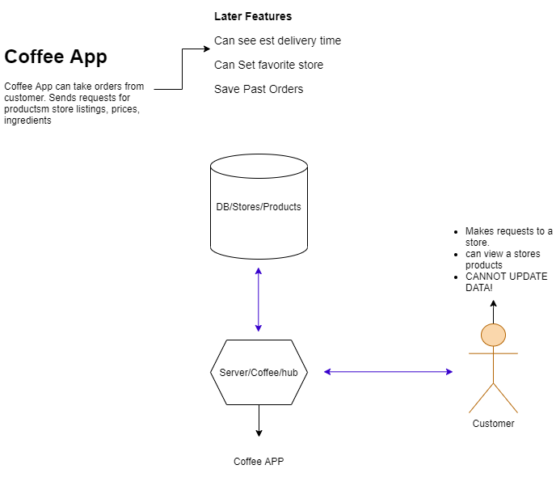

# Coffee
Coffee app for handling ordering coffee from coffee companies

## Author:
- [Brendon Hampton](https://www.linkedin.com/in/brendon-hampton-37132899/)

## Links and Resources

- [ci/cd](https://github.com/BrendonLH/Coffee/actions) (GitHub Actions)
- [back-end server url](http://xyz.com) (when applicable)
- [front-end application](http://xyz.com) (when applicable)

## Setup

#### How to initialize/run your application (where applicable)

#### How to use your library (where applicable)

#### Tests

## UML

